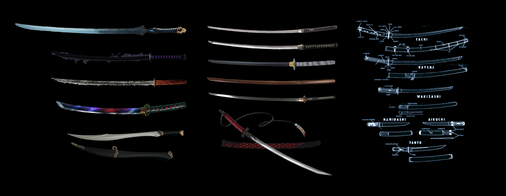

# Masamune's Armoury

Samurai Swordsmith, Master Gorō Nyūdō Masamune

## Base Items

Everything produced in the workshop of Master Gorō Nyūdō Masamune is of exquisite quality and is priced as such. Base prices are typically 3 times the standard item prices listed below. All blades are crafted in the Samaurai style. Special orders may take weeks or months to deliver, depending on requested build.

* Longsword - 30gp - 1d8 slashing - versatile (1d10)
* Dagger - 2gp - 1d4 piercing - finesse, light, thrown (20/60 ft.)
* Shortsword 10gp - 1d6 piercing - finesse, light
* Scimitar - 25 gp - 1d6 slashing - finesse, light
* Rapier - 25 gp - 1d8 piercing - finesse
* Greatsword - 50 gp -	2d6 slashing - heavy, two-handed
* Handaxe (Cleaver) - 5gp - 1d6 slashing - light, thrown (20/60 ft.)

## Special Properties and Options

* NOTE: Items that combine mulitple properties/options maybe exponentially more expensive.
* NOTE: Some properties/options may not be stackable with certain other properties/options.
* Silvered (+100gp) - Some monsters that have immunity or resistance to nonmagical weapons (incorporial undead, for example) are susceptible to silver weapons.
* Ornate design (+100gp) - the hilt of the sword is of ornate design. This confers no martial benefit.
* Vicious (+350gp) - **magic** - When you roll a 20 with this magic weapon, the target takes an extra 7 damage of the weapon's type.
* Adamantine (+500gp) - **magic** - Whenever an adamantine weapon hits an object, the hit is a critical hit.
* Sharpness (+1500) - **magic** - When you attack a creature with this weapon and roll a 20 on the attack roll, that target takes an extra 14 slashing damage. Then roll another d20. If you roll a 20, you lop off one of the target's limbs, with the effect of such loss determined by the DM.
* +1 Weapon (+1000gp) - **magic** - +1 to attack and damage rolls.
* +2 Weapon (+4000gp) - **magic** - +2 to attack and damage rolls.
* +3 Weapon (+16000gp) - **magic** - +3 to attack and damage rolls.