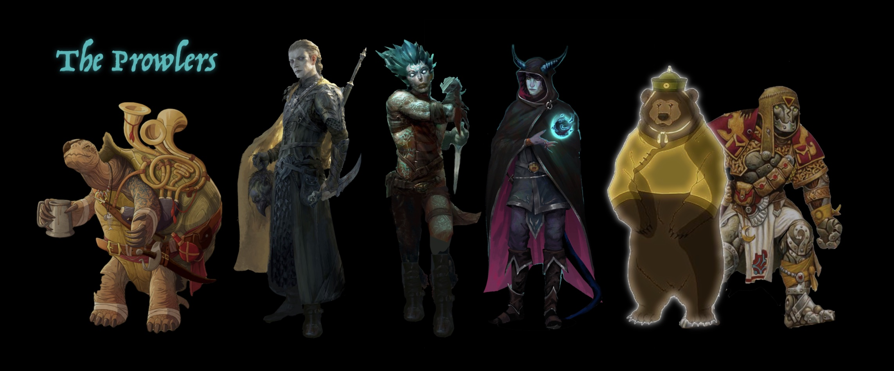

# "The Prowlers" - D&D Adventuring Party

## History and Motivations

### As a party...
* The PCs met on a slave ship, after being individually captured by pirates
* After a long and arduous voyages in the bowels of the slaving vessel, they were sold as gladiator fodder.
* Their bond was formed as they forced to fight as a team in the training arena
* And then continued to develop as they escape with Onyx and began an adventure as runaways

### As PCs...

#### Viccard (Daniel)
* Shadow Elf (Shadar-kai) Ranger
* Background as Acolyte of the Order of the Raven Queen
    * Sworn enemy of the forces of undead
    * Betrayed by usurper head priest of his order, who he believed to be an enemy infiltrator...
    * Kidnapped and sold into slavery 
* Motivations
    * Fight the forces of undead, and develop the power to do so...
    * Investigate and resist the mysterious rising tide of ancient Necrotic powers in the East...

#### Morze (Keegan)
* Genasi (half water-genie) rogue
* Background as Pirate
    * Instigated a mutiny, which failed
    * Thrown overboard and left for dead
    * Kidnapped and sold into slavery 
* Motivations
    * Take revenge on his old pirate captain, The Marquis de Demi Lune
    * Become a pirate captain himself
    * Became rich and famous
    
#### Repentance (Matt Allen)
* Tiefling (taint of infernal bloodlines) Warlock
* Background
    * "My family is tied to an underworld fiend whom I have turned my back on. I will never go back and will fight for my freedom from the evils of the underworld at any cost..."
* Motivations
    * Retain his freedom and independence from his family
    * To obtain the perfect weapon to make his "Pact Blade"
    * Secretive beyond that...

#### Onyx (Frank)
* Warforged Cleric
* Background as Medic for the AAA Syndicate, Gladitorial Training Facility
    * Was purchased in the Thay port city of Bezantur, by the Wizard Razzadon (member of AAA Syndicate)
        * Memory was wiped prior to his sale
    * Convinced to elope with the party...
    * Now a runaway, disguised as a Circus Bear
* Motivations
    * Explore the world and collect samples...
    * As a warforged, he has an "unusual outlook"...
    
#### Thomas the Tortle (Matt Jones)
* Tortle Bard
* Background as Entertainer
    * Tortles have an innate drive and enthusiasm for travel and exploration
    * Was on his way to Blacksand to make money performing in Blacksand during the lead-up to the Great Gladiatorial Gala 
        * Gala put on by the mysterious Pirate King of Port Blacksand, Lord Azzur, in celebration of his marriage to his 3rd wife...
        * A very glamourous event drawing in tourists, pirates, nobels and adventurers from all over the Sea of Fallen Stars
    * Trip was rudely interrupted when the ship he booked passage on disappeared into a whirlpool
        * Whirlpool was actually a magic portal that teleported the ship into a cavern beneath the volcano island known as Fury Mountain
        * There a large tribe of kobolds was running a scheme to teleport in boats, smash them with surprise, cannons and an overwhelming assault... And then collect the treasure and spoils to offer to the dragon Beatrix... 
        * The kobolds worship the evil and arrogant Red Dragon known as Beatrix, who is the Mistress of Fury Mountain
        * Thomas was saved from certain death when the party, who were wandering lost inside the volcano, happened upon the scene and then joined the battle!
    * Thomas has been travelling with the party ever since
        * Down a water chute deep into the Underdark...
        * Lost wandering in the deep caverns beneath Fury Mountain, and eventually wandering into mushroom caverns
        * Met the reclusive Gnome Wizard, Cheshire ZimbilZombil
        * Escaped Fury Island via Cheshire's gaint Turtle submarine, "The Tortilus"
        * Helped Cheshire infultrate the Deepsea Vault of Golorr, and retrieve the mysterious artefact, "The Stone of Golorr"
        * Made landfall at the trading outpost known as "Fort Doug"
        * Met the Tortle Travel Writer, Humphery Tortle
        * Party purchased a small boat, and named it "The Implication"
        * Sailed to Blacksand as free adventurers!
            * Fought off multiple pirate attacks
            * Fought off a Giant Sea Snail
            * Met "The Sashimi Hunters", a crew of elite seafood hunters, with a samurai-like code
        * Arrived in Blacksand!
* Motivations
    * Travel, exploration, adventure, performing...
    * Up to you...
