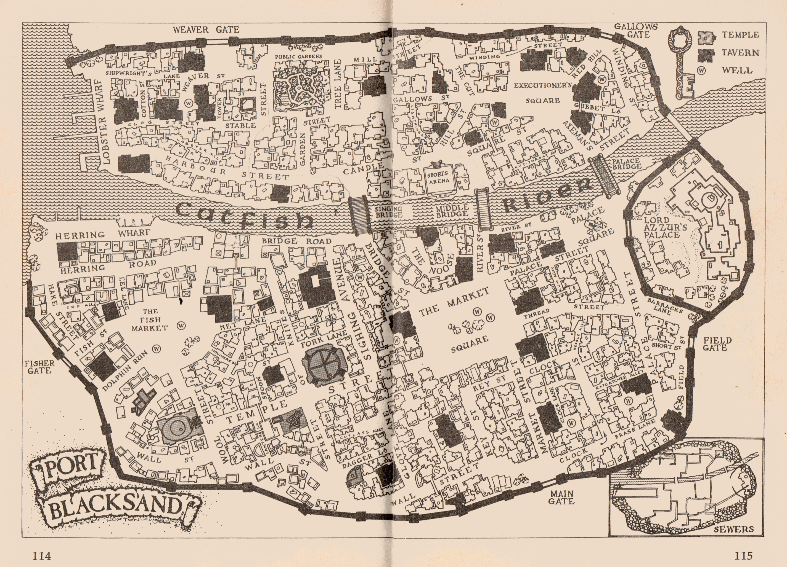
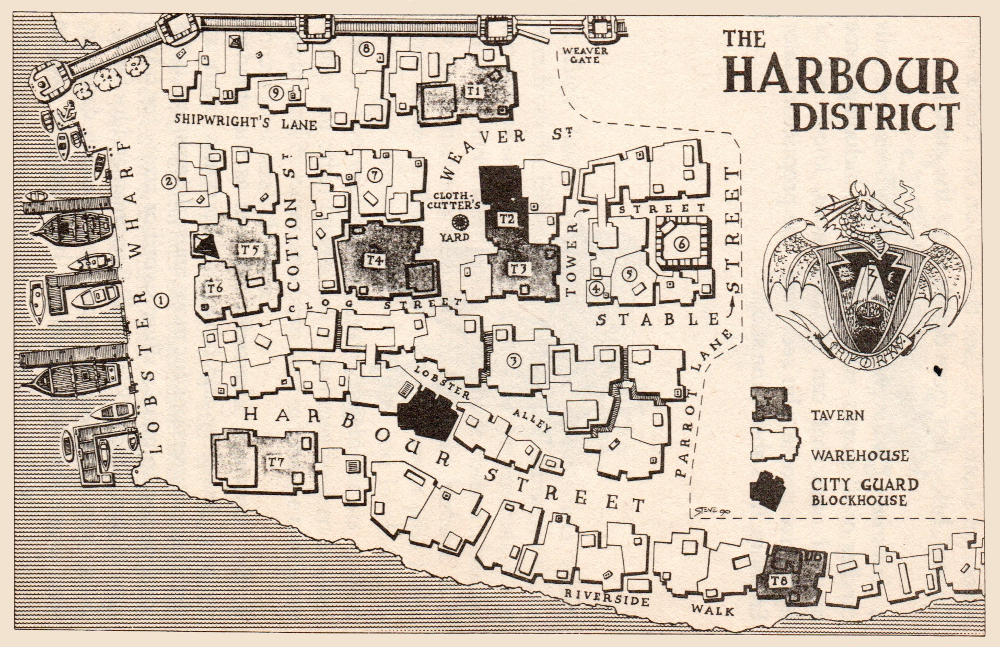
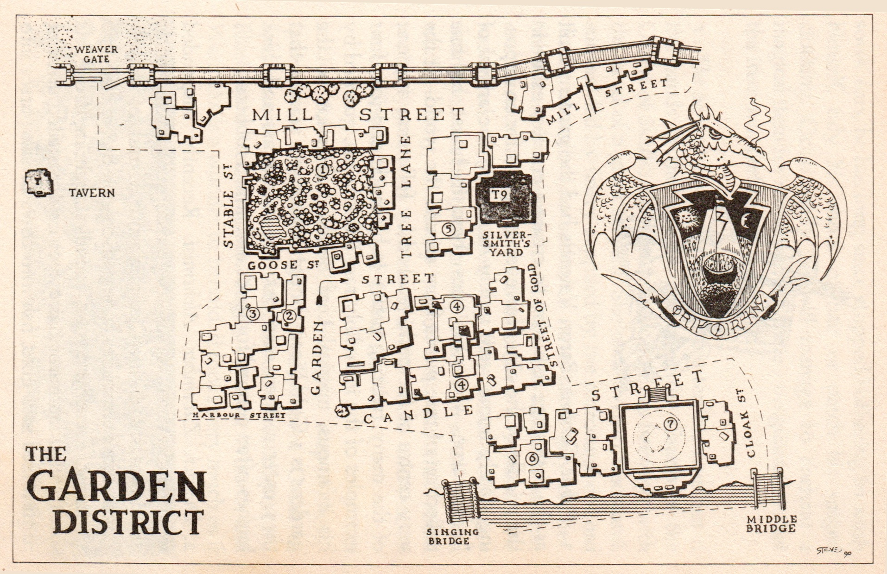
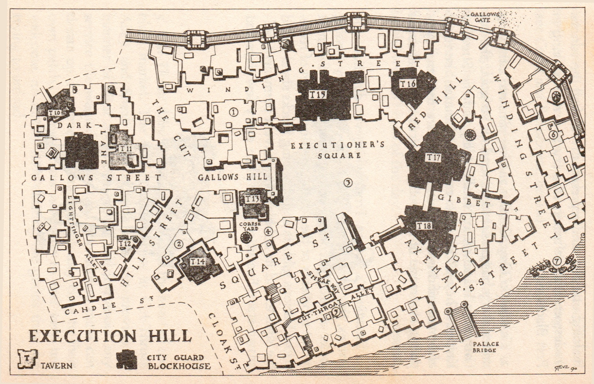
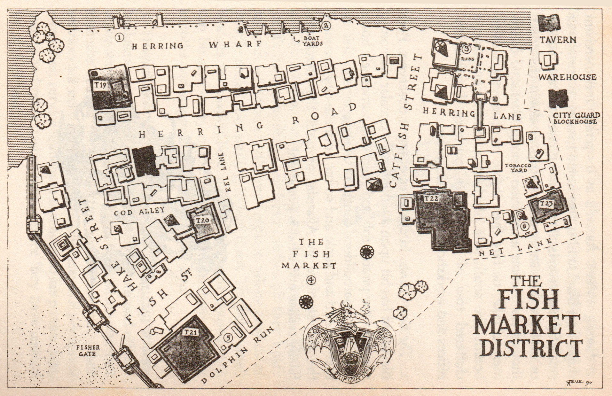
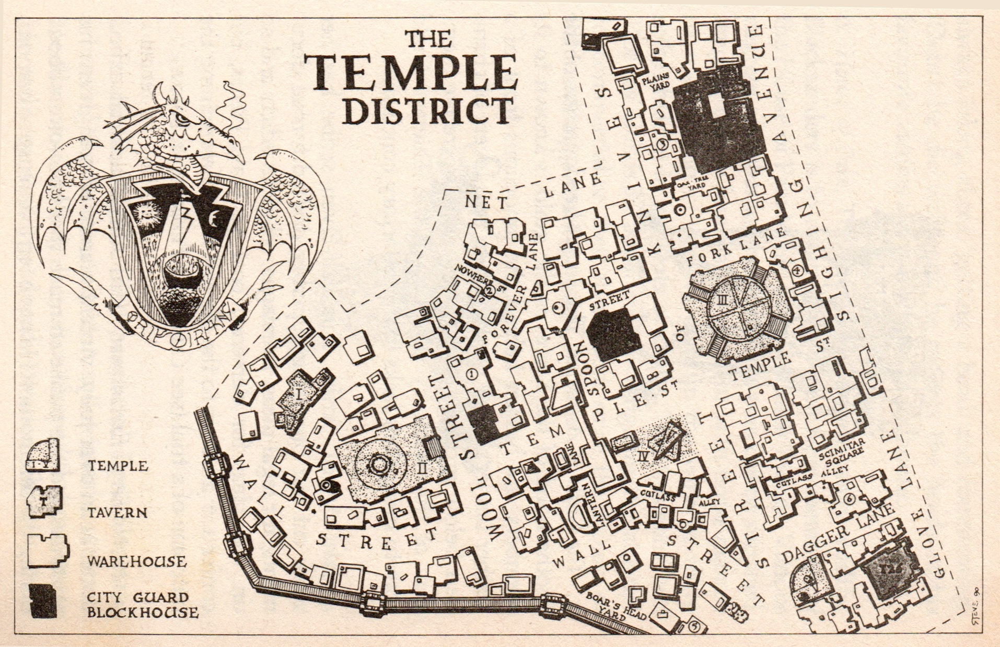
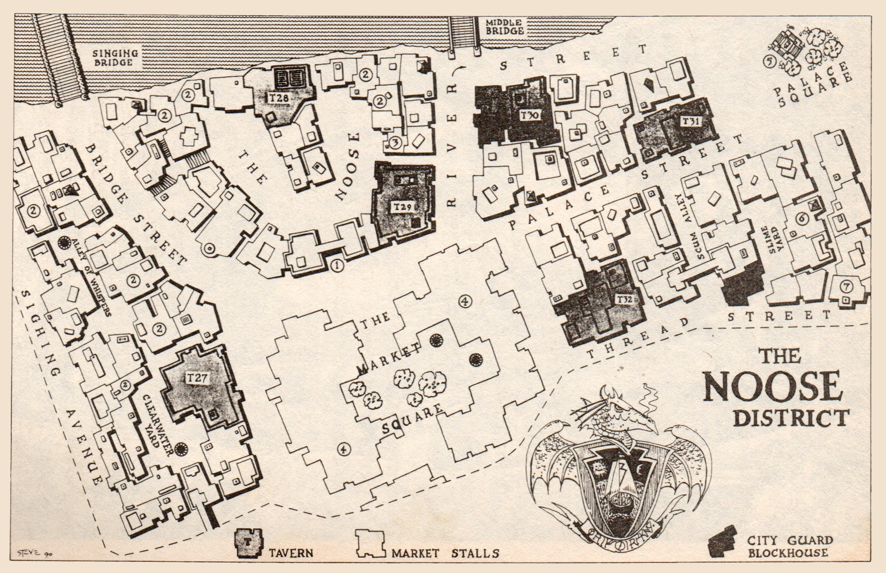
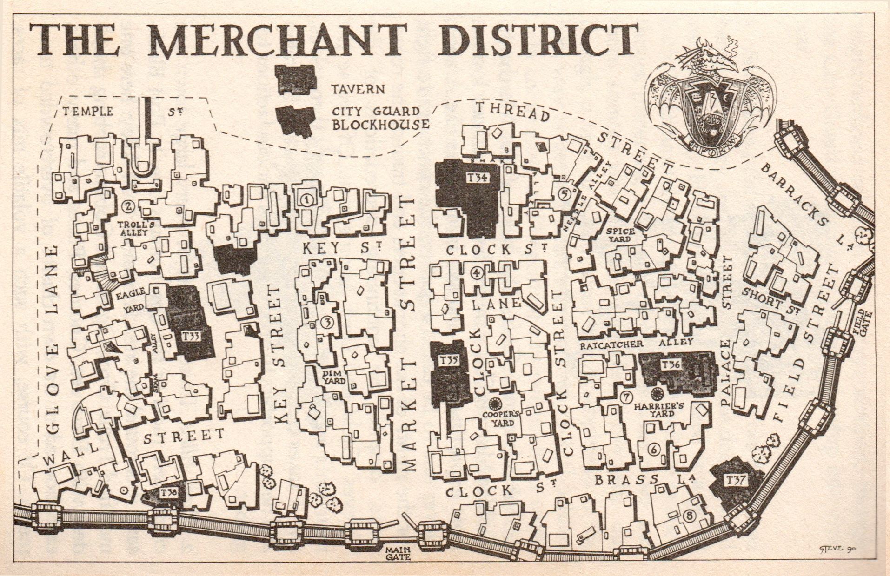

# PORT BLACKSAND - A Travelers Guidebook
### By Humphrey Tortle

## Harbour District 

This is the oldest part of Port Blacksand. Its streets are winding and narrow, and its houses look very ancient and weather-beaten. In some streets the upper storeys overhang the road and shut out the daylight. (The district qualifies as 'Poor' when rolling on the Businesses Tables...) 

1. Lobster Wharf. The Catfish Reach is sheltered slightly from the open sea by the northern headland, making a natural harbour. There are always half a dozen or more pirate galleons and galleys at anchor here, except in the summer months, when they will be away, harassing merchant ships in more southerly waters. Trading ships also call in on their way to the open sea or upstream to Fang, Zengis and beyond. Among the most notorious ships that call here are the Black Swan, the Swordfish, the Dancing Dolphin and Lord Azzur's own magnificent Face of Chaos. At the far northern end of Lobster Wharf, where the smaller fishing boats pull in to unload their catches, there stands an immense iron anchor, said to have belonged to a trading galley from ancient Carsepolis. 

2. Fishermen's Cottages. Along the east side of the wharf runs a cluster of rickety single-story cottages, home to many of the fishermen who risk their lives on the high seas every day. On fine days, the fishwives sit outside their homes, weaving nets and repairing lobster pots. 

3. Mariners' Guild. The outside of the guild house is decorated with ivory carvings made from whales' teeth and showing various scenes of maritime adventure. The ground floor is made up of offices which handle the daily business of the guild, while the dormitory rooms on its first and second floors can sleep more than 100 sailors on shore leave. (See the section on 'People and Powers', below, for more details about the guild.) 

4. Erethrim's Candle Shop. The Elf who lives here sells candles of all shapes, sizes and colours, including some magical ones that can induce visions, knock out or hypnotize people who see them. The proprietor, Calor Erethrim, lives above the shop. 

5. Ben Borryman, Silversmith. As well as the standard range of jewellery and tableware, Borryman often un-dertakes commissions for more unusual items, and is the ideal person to make a silver sword or arrow for taking care of that difficult Werewolf! Borryman and his family (wife, two grown-up sons and one teenage daughter) live above the shop, leaving a huge hunting dog on guard in the shop at night. 

6. Eagle Tower. The ornately decorated tower which rises from the hillside to loom several decametres above the surrounding buildings is in fact the protruding top half of an even taller tower which once housed a beacon to guide mariners safely into Carsepolis harbour. It is now home to Shareela, a reclusive woman who keeps her huge collection of birds in the top levels of the tower. The eagles which give the tower its current name, and other hawks, can sometimes be seen swoop-ing around its eaves, and from time to time are rumoured to carry off small children. 

7. Eltan, Tailor. The oldest, and still the best, cloth maker and outfitter in Port Blacksand. Eltan himself has now retired to somewhere safer, and the business is run by his two sons, Oltan and Ultan. Clothes made here are very expensive, but they fit perfectly and last a lifetime. The brothers live above the shop with their wives and seven children. 

8. Jimmy Quicktint, Tattooist. The self-proclaimed 'get Tattooist in Town', Jimmy is a big, jovial ex-sailor who learned his craft in Halak while sailing with the notorious Captain Bartella. Tattoos cost 5-50 Gold Pieces, depend-ing on their complexity. Quicktint lives in a couple of rooms behind the shop. 

9. Harbour-master's Office. Port Blacksand's harbour-master, Eril Gor, is a crusty old ex-mariner, whose rolling gait is due less to his years at sea than to his wooden left leg. Gor presents himself as a scrupulously honest officer of the city, replying to any who ask, 'No amount of gold or silver can persuade me to allow goods into or out of this city without paying the proper duty.' Instead, he demands a set fee of 5 per cent of the goods themselves, which are then disposed of by Gor's many contacts round the city. 

### Inns and Taverns 

T1. The Mermaid Tavern. 
This busy alehouse's cellar hides a secret entrance to the sewers, which in turn lead down into the ruins of ancient Carsepolis. Landlord Lamy Rognar charges 20 Gold Pieces for an adventurer to set out down into the depths (and has sometimes been known to charge another 20 GP to let them out again!). The tavern is of **Average quality**. 

T2. The Eye of the Needle Tavern. 

T3. Gashanka's Tavern. 

T4. Valentis' Bane Inn. 
A favourite with the nastier pirates. Its name refers to Lord Azzur, and his coat of arms are depicted alongside the Face of Chaos on the sign outside. **Awful quality.**

T5. The Vulgar Golblin Tavern

T6. The Hemlock Tavern. 

T7. The Black Lobster Inn. 
Being one of the inns nearest to the harbour, it is always full of drunken pirates and other mariners celebrating a successful voyage, and clever professional gamblers and pickpockets taking their new riches from them. Adventurers and other travellers looking for passage to other lands are also regular customers. The permanently half-drunk landlord, Halron Allierte, is only a temporary manager, looking after the inn for its owner, his uncle Guidon, who also owns places in Rimon and Halak. **Poor quality.** 

T8. The Dagger Tavern. 
Apparently a quiet, orderly public house, it is in fact a front for a major smuggling operation run by the Merchants' Guild, who bring in expensive goods at night in order to avoid paying Azzur's crippling import taxes. The small front bar is the only part of the establishment where the public are allowed, a rule enforced by the immense landlord, Doric Sandwasp, and his two Half-Ogre bottle-washers. **Fair quality.**

## The Garden District 

Named after the large public gardens which dominate the area, this is a wealthy district of mostly private houses, though some of them also serve as the offices of a number of professional people, such as musicians, artists and court officials. (Wealthy', when rolling on the Businesses Tables)

1. Public Gardens. Baron Valentis had the gardens built as the first stage in a plan to create a country estate in the middle of the city. However, his plans for an imposing stately home were rudely dashed by the arrival of Lord Azzur, who now uses them to house his fine collection of rare plants from around the world. At the very centre of the park, reached by following any one of the many twisting paths, is his pride and joy, four examples of the incredibly rare Black Lotus, guarded by his infamous, magical Leaf Beasts. Admission to the gardens is 1 Gold Piece, though visitors are warned that they enter at their own risk; the long grass and thick bushes often conceal footpads and armed robbers.

2. Dietrich Zuvember, Alchemist. Recently suspended from the Sorcerers' Guild for transforming the beard of its vice-master, Stirk Cuckling, into a nest of snakes, Zuvember exemplifies every cliche of the crazed old alchemist. Usually to be found staggering from his smoke-filled laboratory after yet another failed attempt to turn lead into gold, fish into cows or silk purses into sows ears, he has long since stopped bothering to wash himself, tidy his shock of hair or patch his singed clothing. Occasionally he will manage to enchant a magical item for someone, but there's no guarantee that the item will perform as requested. 

3. The Serpent Queen. After suffering terrible cruelties at the hands of the sorcerer-priests of the Caarth of the Desert of Skulls, this nameless woman has been left with the head of a giant serpent! She now lives in Blacksand, surrounded by finery supplied by the patronage of Lord Azzur himself, who seems to have taken pity on her. She is a witty conversationalist, but has a terrible temper, and rumours abound about the numbers of retainers she has killed. Other whispers say that Azzur would pay dearly to have her transformed back into a whole woman again — why, the lucky person who did that could probably name his own reward! (For more information on the Serpent Queen, see Out of the Pit.) 

4. The Sorcerers' Guild. The bizarrely shaped head-quarters of the Most High Amalgamated Guild of Spellcasters, Sorcerers, Magicians, Prestidigitators, Illusionists, Necromancers, Sages, Witches, Wizards and Warlocks is a wonder to behold. It looks very much as if it was designed by an insane, cross-eyed architect while under the influence of some strange, illegal substance, and features a great many spires, towers, flyovers, over-hanging balconies, buttresses and domes. It is also split into two buildings, linked by a wide bridge: the smaller half is the home of Lord Azzur's court magician, Duramax Frogshaper, and his laboratories, the location for many frightening experiments; the larger building houses several dozen apprentices, classrooms and (on the top two levels) the library, which contains many tomes rescued from the ruins and dating back to the time of the Age of Wizards.

5. The Great Garolon, Artist. Formerly the court artist of the Baron of Shazaar, Garolon was banished after paint-ing a very unflattering portrait of the Baron's daughter (in which she was indistinguishable from the horse she sat upon!) and has lived in Blacksand for five years. He has thrown himself into being a 'proper' artist, being a drunk and a womanizer, and sporting a long beard and a paint-spattered smock. He will paint portraits or other Pictures for anything from 10 to 10,000 Gold Pieces, depending on whether he likes the person (fellow drunk-ards always get their pictures painted cheap!). On fine days his current mistress sells his pictures and artist's materials from a stall outside his studio. 

6. Mr Alden, Thief for Hire. This large, elegant house with a pleasant riverside aspect is home to Port Black-sand's most successful thief. Although registered with the Guild of Thieves, he plays no part in their murderous hierarchy, and takes only those jobs which provide him with a decent challenge. Clients are usually recom-mended for his extra-special services by a discreet friend, who instructs them to ring four times on his doorbell at exactly a quarter past eleven at night. They will be met by Alden's silver-haired butler, who tells them that 'the master' is not at home but, if they will tell him all their details, he will pass them on. Of course, this is really the thief in disguise; if the job seems acceptable, he will reveal himself. He works for a flat rate of 30 per cent of the profits and will not steal anything that he cannot carry on his own. His careful planning and high success rate have made Mr Alden a legend among thieves. 

7. Sports Arena. This large stadium, in the form of a square surrounded by tiers of stone seats, is the venue for many regular and special sporting events. Once or twice a week it plays host to gruesome gladiatorial contests, featuring duels and man-versus-monster battles. The stadium also puts on games of Bays' ball, Dwarf tossing, Pixie throttling and — an especial favourite — Shoot the Apple if the Goblin's Head (more popularly known as Completely Fail to Shoot ...). Entrance is usually 1 Gold Piece per person, though some games are free. 

### Inns and Taverns 

T9. The Silver Coin Tavern. The sole drinking establish-ment in Garden District is a very refined place, which doesn't actually sell anything as 'common' as beer. Instead, they offer a wide range of fine wines, meads and a whole host of exotic spirits, imported from the twelve corners of the world. Prices are very expensive, as one would expect, but the clientele is select and the conversation witty and intellectual. The private saloon at the rear of the bar — admittance restricted to certain close friends of the owner, Julius Oftran — is where many of the most daring crimes in the city are meticulously planned. (Great quality.) 

## Execution Hill

At the top of Gallows Hill, at the centre of this district, stands the bleak, windswept square which gives the area its name. Some of the buildings perched on the quite steep hillsides are becoming unstable, and occasionally an ageing beam will snap and a top floor will crash down into the street below. On the southern side of the hill, the buildings are packed more tightly together and roads can turn into steep flights of steps before a cart-drover knows it. (This district is 'Poor', if rolling on the Businesses Tables.) 

1. Tradesmen's Guild. Within this imposing slab of a building one may find representatives of all the various tradesmen and craftsmen who try to scrape a living in Port Blacksand. 

2. Carulus the Grey. Carulus and her sons run a thriving undertaker's business. Indeed, trade is so good she has two other branches, in Needle Alley and the Street of Knives. They all provide ceremonial burials, burnings and mummifications, handled with rare tact and sympathy, at a range of competitive prices to suit all social classes. 

3. Executioner's Square. From whichever direction one arrives, this ghastly place has to be entered by passing under an arch, decorated with the remains of the most recent recipients of the square's particular form of recreation. Various gibbets and chopping blocks stand round the square, and its cobblestones have a permanent red-brown stain. Executions take place every few days and always popular, though they do attract different 5aorert; of crowds according to the method being used (See Crime and Punishment, below). 

4. Corpse Yard. The well in aptly named Corpse Yard is currently blocked up because three nights ago a street urchin, while trying to retrieve a coin he had dropped, discovered a mass of bodies at the bottom. Seventeen have been retrieved by the City Guard so far, each killed in a different way. A large Troll is now on guard by the well all hours of the day. 

5. Cut-Throat Alley. This part of town is the heart of the black market. The traders who gather in Cut-Throat Alley and Sneak Way as dusk falls can provide all manner of illicit and stolen goods and just about any service the warped human (and non-human) mind can dream up. However, the traders jealously cling to their own patch, and new faces are made to feel very un-welcome, no matter how exciting the goods they are trying to unload. 

6. Baraban, Professional Murderer. This fellow is an ac-complished swordsman and duellist, and is also high up in the Assassins' Guild. His usual method of killing is to pick a target, arrange somehow for a duel to be called for and, after winning, attempt to collect a fee from those benefiting from the victim's death. He manages to escape justice by carefully arranging it so that matters look innocent or legal, and by liberally sprinkling bribes among the City Guard and magistrates. He is said to be a very wealthy man. 

7. Boats for Hire. The landing stage at the bottom of Axeman's Street is always jammed with hundreds of small boats which can be hired to take one downriver, even as far as Lobster Wharf. There is a flat fee of 1 Gold Piece per journey, and the oarsmen take no re-sponsibility for any accidents which may happen along the way. 

### Inns and Taverns 

T10. The Gargoyle Tavern. 

T11. The Red Lantern Tavern. 

T12. The Four-way Cross. 

T13. The Rat in Hand Tavern. This unruly place is named after the strange game of chance, invented by its landlord, Hoggwell Hogg. Players bet on the number of starving sewer-rats they think one of them can hold in his or her hand for three minutes. The current record is eight, though the drunken Troll who set it then tried to better his own record and ended up losing his entire hand. (Average quality.) 

T14. Varag's Splendid Alehouse. This establishment is probably the roughest in the entire city. It is run by the Dwarf, Varag Madhand, a retired adventurer who hasn't lost his enthusiasm for a really good scrap! As a result, fights break out here every night, and the furniture and crockery are always having to be swept up. (Average qty•) 

T15. The Sun and Seven Stars Inn. 

T16. The Cat and Crucifix Tavern. Unfortunately, the stomach-turning sign of this den of scoundrels is the first thing many visitors to Port Blacksand see when they step through the gate. The tavern is also home to a large number of con men, who pretend to make friends with new arrivals before trying to steal everything they came with. (Average quality.) 

T17. The Headless Troll Inn. The rivalry between the landlord, Maxim Vibril, and the host of the inn across the street, the Troll Gobbo Donzo, is such that Maxim renamed his place (previously it was the Flying Foxbat) and had a very realistic sign painted. Dona, responded by having Vibril's face painted as that of the victim on his sign. Since then, any number of mysterious poisonings, fires, floods and infestations have occurred. The regular customers of each inn are very loyal to their host, and on a Seaday night think nothing of rushing across the street to knock a few heads together. (Fair quality.) 

T18. The Laughing Axeman Inn. See the Headless Troll Inn, above. (Fair quality.) 

## The Fish Market District 

The pungent stench of raw fish hangs over this part of town; when it is foggy, the smell somehow gets even worse. Most of the buildings near the wharf are warehouses, piled high with exotic goods from all corners of the known world. The district is 'Poor' if rolling on the Businesses Tables, but roll on one of the Merchant Businesses Tables if determining the contents of a warehouse. 

1. Herring Wharf. As well as its pirate and merchant ships, Port Blacksand is also home to a large number of small fishing vessels. Some can be hired to take parties or individuals a short distance up or down the coast, though it's become a tradition among Blacksand fishermen to take the fare then throw the passengers overboard! The south side of Herring Wharf comprises a cluttered row of fishermen's cottages, boatbuilders' offices and workshops, and warehouses. 

2. The Boat Yards. In the eyes of some observers, Port Blacksand has hit upon a wonderfully circular economy, whereby the pirates rob and then sink someone's boat; then the boatbuilders construct a replacement; this is then robbed and sunk; and so on, until the city becomes the richest place in Allansia, or until the merchants finally realize just what is going on! 

3. Burnt-out Buildings. The charred stumps of a few wooden walls are all that remain of five buildings which burned down (an act of arson, in fact, by members of the Thieves' Guild, for non-payment of protection money). 

4. Fish Market. Each morning as dawn breaks, Blacksand's fishermen drag their fresh catches off their boats and run with them to the marketplace, where crowds of people are always waiting to buy them. The fishy smell is at its very worst here, and many people unused to it can be seen every day, clutching handkerchiefs to their mouths and staggering away from the area. 

5. Pungent and Stark Exterminators. These two strange tradesmen are very adept at tracking down and eliminating vermin, despite (or perhaps because of) the fact that the first is blind and the second is deaf. Their services are very expensive — around 100 GP per room! — but their service somehow manages to keep mice, rats, insects and other nasties from a place they have treated for up to a year. 

6. The House of Masks. Visorr Peppeto the mask maker earns his living with the aid of an enchanted mould inherited from his grandfather, who was by all accounts a great sorcerer. The mould forms round any head pressed into it and can then produce exact copies in papier-mache. However, one side-effect of wearing such a mask is that, after two hours, the wearer has a 1 in 6 chance every hour of starting to exhibit some of the characteristics of the creature from which the mask was modelled! Costs: animal masks 1 GP, monster masks 1-6 GP, famous people masks 2-12 GP. 

### Inns and Taverns 

T19. The Drunken Fisherman Inn. As you might expect, this inn is decorated after a piscatorial nautical theme, and its clientele are admirably summed up by the place's name. A small tower is built on top of the roof, and from it a burning beacon lights up the night to guide sailors back to port. The beacon cannot be seen from the city. (Average quality.) 

T20. Osric's Arms. 

T21. The Silenced Watchman Inn. 

T22. The Pirate's Ghost Inn. Despite its fanciful name, this building has never, so far as anyone can remember, been haunted. In fact it's a new enterprise, by a speculator called Cozimo Warbler who turned a very plain but comfortable alehouse into a frightfully artificial 'Olde Worlde Sailor's Taverna'. It is only ever visited by strangers to the city; the locals avoid it like the plague — and if he's not careful, Warbler will be going bankrupt yet again. (Average quality.) 

T23. Pipe's Famous Alehouse. While his wife pursues her own career in flowers (see Merchant District, below), Dumdle Pipe puts all his hard work into his tavern. The couple haven't spoken or lived in the same house for forty-four years, a condition which both describe as 'very satisfactory'. Mr Pipe can be very embarrassing in female company, and is always sporting blackened eyes and bandages covering wounds received from disgruntled customers. (Good quality.) 

## The Temple District 

In Port Blacksand, as happens anywhere, some types of business tend to cluster together. Most of the city's armourers and weapon makers are to be found in the block of buildings formed by the Street of Knives, Cutlass Alley and Dagger Lane. So it is of Blacksand's main temples, most of which are found in or near the Street of Temples. The street itself is wide and quite pleasant (by this city's standards it certainly is), but most of the rest of the area is made up of twisting back streets and alleys. (Use the Merchant Businesses Tables.) 

1. The City Courts. Prisoners to be tried by the magistrates in the city courts are usually kept in the City Guard blockhouse next door until sent for. There are three courts, served by a collection of seven magistrates, who usually deal out their own form of justice from dawn until dusk, to try to cope with the backlog of cases that always need trying. For more details, see the section on Crime and Punishment, below. 

2. Nowhere Street. This street proudly proclaims its name on a metal arch above its entrance. It is lined on both sides with small booths in which one can play just about any form of gambling game known to man or Dwarf. The booths continue along Forever Lane, the games getting harder to beat and the wagers getting huger all the time. The very last set of booths is decorated in black ribbons: here the truly desperate bet their lives in the hope of miraculous winnings. It is a terrible, inhuman place, frequented by only the lowest of the low. 

3. The Guild of Assassins. The secret headquarters of the Brotherhood of the Knife, as the guild is known to its members, are hidden behind the innocuous front of a leather tanner's small workshop. In two layers of chambers below ground level, however, the secretive members of this shadowy offshoot of the Thieves' Guild plan to bring their tasks to a satisfactory conclusion. 

4. Jalal Armen, Scribe. This half-elven scribe has her work cut out preparing superbly drafted formal documents, for legal pleas, marriages, religious edicts and so on. Her pleas for clemency cost 30 Gold Pieces, but confer a +2 bonus to the die roll when determining the outcome of a trial (see Crime and Punishment, below). 

5. Hister Brey, Executioner. Lord Azzur's official execu-tioner is an over-jolly, violent maniac who frightens his prisoners and the public so much that he is often booed during the ceremonies! He has a terrible sense of humour always joking about 'getting a head' and commenting, 'Didn't die well!' and he mounts the heads of his favourite victims along the front of his house. 

6. House of Pain. The latest craze among really wealthy Biacksanders is to commission a visit from members of the House of Pain to the homes of their friends. Various degrees of embarrassment and true pain can be supplied, ranging from a humiliating accident with horse manure to a sprinkling of ground glass in the wine or sharp spikes hidden in the seats of chairs. The Assassins' and Thieves' Guilds are apparently investigating this attempt to commercialize their livelihood, since the House of Pain is doing a roaring trade! 

### Temples 

1. Temple to Dalgalla. The people of Port Blacksand worship Dalgalla as a holy man and original founder of the Blacksands colony. It is often claimed that prayers to his memory have produced miracles, though these stories usually prove to be false. The real man, called Daralaga, was a pirate captain's First Mate; he may have settled in the early colony, but he was never a holy man.)

2. Temple to Solintliar. The patron deity of mariners is celebrated in an ornate temple constructed from ivory, coral, shells and old boat timbers. His influence is especi-ally strong among the fishermen and pirates, and his High Priest, the wizened Yuro Furtha, is always called on to bless new vessels being launched in the boat yards. 

3. Temple to Fourga. The God of Pride is very popular with the ordinary people, for he is what they regard as a 'proper god: vengeful, punitive and generally superior. His priests preach fire-and-brimstone sermons of quite awesome power, ensuring that the huge domed temple is always full on holy days. 

4. Temple to Sukh. Appeasing the God of Storms and Winds is vitally important to fishermen and pirates alike; and being chosen for the annual ritual human sacrifice is actually looked on as a great blessing in some quarters — though only by those who haven't been chosen! The temple is fashioned in the form of a huge boat with its sail full of winds. The mast is a narrow tower from the top of which an acolyte (the 'Voice on the Wind') calls the faithful to prayer every evening, and from where the annual sacrifice is thrown 'into the arms of Sukh', though the god has yet to bother to catch the unfortunate. 

5. Temple to Kukulak. Lord Azzur brought his personal holy man ashore with him when he settled in Port Blacksand, setting him up in his own temple in Dagger Lane. The building is squat and undecorated, and never appears to be open, though the priests can sometimes be seen striding through the streets in their all-concealing black robes. Sometimes, however, very late at night, the priests of Kukulak gather to praise their master and perform the ritual of burning with prospec-tive new acolytes. Azzur is reputed to attend these ceremonies, though most of the time he receives the High Priest within the walls of his own palace. (For more notes on Azzur and Kukulak's rituals, see Titan.) 

Inns and Taverns 

T24. The Hog and Frog Inn. The biggest inn in the city is run by perhaps the largest man in the city; its landlord, Doloric Cloudscraper, is the offspring of a short Hill Giant and a human. As a result of his height and girth, everything in the Hog and Frog is larger, wider or taller. The place is of Good quality, is popular and boasts a wide range of clientele. It is divided into a number of halls for eating, gambling, listening to a minstrel or just having a quiet conversation. Stables and bedrooms are arranged round the central courtyard, and at the far end of the building is the Cloud brewery. The ale it produces was originally named after the tavern, but Doloric got tired of all the jokes about its reputed ingredients. 

T25. The Jumping Fish Tavern. 

T26. Jury's Alehouse. 

## The Noose District 

Proving that the very heart of Port Blacksand is hope-lessly corrupt, the central Noose District is most famous as the home of the shadowy but powerful Guild of Thieves. An air of crime and decay hangs over the whole area, and when the wind whistles down Bridge Street past the apparently empty houses it can be a terribly sinister place. There are a great many beggars on the streets in this district, as well as the occasional duster of shady-looking people hanging around at corners and in alleys, just watching everything that goes on. The Noose is also the site of the Market Square, however; during the day this is always bustling with traders and customers in search of a good deal. (The area west of Middle Bridge is a 'Poor' area; east of River Street, it is a 'Merchant' area.) 

1. Noose Gate. The low gate into the crescent which gives the whole district its name is always discreetly guarded by a couple of burly thieves. They are there to keep stray sightseers out and to give their bosses ad-vance warning that someone with legitimate business is in the area. Indeed the network of beggars, urchins and thieves is so well organized that very little happens within this district — and in much of the rest of the city — that they don't know about. Note that the City Guard do not venture past Noose Gate without a prior appoint-ment, no matter how urgently they may need to. 

2. The Thieves' Guild. Those who know nothing about the Guild of Thieves except what they hear in whispered rumours from their neighbours seem to visualize the guild headquarters as a massive black building in the heart of the Noose. In fact, there is no single guild building; instead, the shadowy organization owns at least eight buildings, each of which serves to house different parts of the guild at different times. There are also other unknown places where the different Master Thieves meet their faceless superiors, and they in turn report to the real head of the guild somewhere else. Most of the buildings look as if they are used for some other business or have been quite abandoned. Anyone who tries to investigate much closer will soon discover that members of the guild have been watching their every move. Some of the buildings can be entered only from their roof or from one of the many new tunnels which criss-cross below this part of the city. In various buildings, apprentices live and train, qualified thieves meet to exchange information or plan jobs, fence stolen items or make specialist equipment. Far from being run-down, this area may well be the busiest in the city! (For more information on the Guild of Thieves, see the section headed People and Powers, below.) 

3. Madame Star's Cottage. This is the small, run-down cottage of Madame Star, clairvoyant and fortune teller, who is usually to be found practising her art in a small booth in the market square. (See Scene 12 of A Shadow Over Blacksandl for more details.) 

4. The Market Square. A market of some sort takes place in the square seven days a week, though its character changes from day to day. On any particular day a number of traders may be selling livestock, or fancy items like silks and spices, or animals both common and rare. The core of the market, though, is always the same, and indeed many regular traders don't bother to dis-mantle their stalls at the end of the day's trading. There are businesses of all kinds in the regular market, provid-ing everything from hot pies to poison, hatpins to helmets, and bonnets to boots. There are also a number of 'entertainments', including minstrels, poets and actors, and wrestlers and strongmen who offer to pay a reward to anyone who can beat them (few can). In the very centre of the market there is a clump of trees, beneath which a number of stocks are set up. These may be filled by 1-6 prisoners at any time. There is also likely to be a number of urchins who are cashing in on the situation, selling for i Silver Piece bags of rotten tomatoes, eggs and cabbages (usually scavenged from kitchen floors the previous evening!) to throw at those in the stocks. 

5. Daggerface's Statue. A couple of years before he was i deposed, Baron Valentis decided to immortalize in stone the various people who had ruled over Port Blacksand before him. In order to raise the money to build each statue, he imposed a crippling tax on food. Only the first one had been built when the people rioted against the tax, and he had to drop the idea. These days Daggerface is looking the worse for wear — and he wasn't very attractive to look at in the first place. Incidentally, Palace Square is also the traditional home of those con men who pounce on newcomers to the city and attempt to sell them the statue, Lord Azzur's palace or even the whole city! 

6. Sims Stickle, Merchant. If you need something, anything, no matter how big or small, commonplace or rare, go to Stickle. The merchant is famous for living up to the slogan painted on the outside of his building: 'What-ever you want, I haven't got it — BUT I CAN GET IT! This is certainly true, for Stickle is prepared to use the services even of adventurers or the Thieves' Guild to obtain especially rare items for his customers
Stickle charges 20 per cent more for goods than they would cost elsewhere — but then most of his goods cannot be bought elsewhere. 7. Talimar the Scalper. Port Blacksand's most ridiculed barber charges very reasonable prices for a haircut, but he always makes such a mess of his customers' hair that they have to wear a hat in public for a couple of weeks thereafter or be ridiculed wherever they go! Luckily, Talimar is much more capable at the other traditional barber's skills: pulling teeth, lancing boils and setting bones. Unfortunately, people don't like to offend him by refusing when he follows a successful operation with: 'Now, how about a free haircut?'

### Inns and Taverns 

T27. The Riddling Reaver Inn. 

T28. The Beckoning Finger Tavern. No one in his or her right mind ventures into this alehouse without an entire regiment of armed guards or a serious death wish or unless they are arm in arm with a Master Thief! Even the City Guard give it a wide berth, for this is where the cream of the guild meet to plot their nefarious deeds. (Good quality, but the Heroes will be very unlikely to be allowed to drink here!) 

T29. The Dragon's Tooth Tavern. As detailed in Don-geoneer (page 26o onwards), Halim Thrumbar's place is a typical adventurer's haunt. Here travellers from all over Allansia can rub shoulders with other strangers and city folk. Anyone seeking that especially dangerous mission to embark on should find just the thing advertised on poster on the wall. (Average quality.) 

T30. The Rat and Ferret Tavern. 

T31. The King's Fingers Taverns. T32. The New Inn. The oldest surviving drinking estab-lishment in Port Blacksand has always been called the New Inn, despite the puzzled complaints of strangers on learning its history. Because of its closeness to the market, it is a very busy tavern (add two dice when rolling for customers for all times except Night) and its rooms are always full of merchants and farmers. (Fair quality.) 

## The Merchant District 

The heart of Port Blacksand's business district runs between the southern side of the Market Square and the city walls. Within this area it is possible to buy just about anything — providing one knows where to go and whom to ask, for there are as many dealers in stolen goods as for legally obtained items. Telling the two apart is often quite difficult. Approaching the royal palace, the small, gloomy shops are replaced by large houses in which dwell some of the city's richest and most devious merchants. (Roll on the Merchant Busi-nesses Tables.) 

1. The Merchants' Guild. The head of the Merchants' Guild is Mercule Sharatan; she has made her vast fortune from importing spices and salt from places like Arantis. Never one to be called a quitter, she continues to fight for the rights of the shopkeepers and traders she represents, despite the continuing depredations of the Thieves' Guild and Lord Azzur's men. Of course the merchants aren't above a little skulduggery themselves, and it takes tremendous efforts on the part of Sharatan and her supporters to hold the guild's various factions together. 

2. Troll Alley. There is a part of every large town and city where most of the non-humans live. In Port Black-sand it is round the area known as Troll Alley: here one may find Trolls, Ores, Ogres and Goblins rubbing shoul-ders with Dwarves, Gnomes, Pixies and many others, each housed in its own cluster of overcrowded tene-ments. Of course, with such a volatile mix of races, neighbourhood relations are always strained, though the City Guard rarely allows them to develop into civil war. 

3. Brakbolden's Bathhouse. The streets of Port Blacksand being what they are (an open sewer, knee deep in mud and unsavoury filth), what many folk need is a good bath. Unfortunately most of them don't believe in such things, preferring to splash themselves with more and more scented oils and perfumes. For those who do, though, a visit to a bathhouse like Brakbolden's is the best way of getting clean. Here one may rub shoulders with commoners and important city personalities while enjoying a bath, massage or steam treatment under the trained assistance of Brakbolden's helpers. Incidentally, more assassinations take place in the steam room than almost anywhere else in the city. 

4. Pipe's Flowers. Effie Pipe has run this shop for many, many years, supplying all sorts of flowers to both the wealthy and the poor. Sometimes she will stock rare blooms from distant lands; this could even be a sentient, man-eating plant or a sleep-inducing Lotus. She is the wife of Durndle Pipe, landlord of Pipe's Famous Alehouse in the Street of Knives (see that entry, above, for further de-tails). 

5. Arlob's Emporium. This shop is piled from floor to ceiling with all kinds of exotic items, ranging from the rarest and most expensive to the totally worthless. If one can't find something anywhere else in the city, chances are that Arlob will have one buried somewhere in his shop. The trouble lies, of course, in finding it; this could take from a few minutes to several months! Arlob himself, a small, snake-like man, never joins in his cus-tomers' search. If they do find something, he tends to make up a price on the spot; the Director should roll 7 dice and subtract 6 from the final result to give Arlob's price in Gold Pieces. 

6. Mercenaries' Guild. Whether you want to hire a single bodyguard or an army io,000 strong, the place to approach is the Mercenaries' Guild. The guild has been petitioning Azzur for many years to make it compulsory for all adventurers living in the city to be members (and, more importantly, to pay their fees!). Blacksand's ruler is mistrustful of the guild, however, suspicious of the existence of a large number of warriors who could be hired by one of his enemies. Besides, he would rather tax the adventurers himself! Still, the guild has several hundred members willing to work for whoever pays their wages. 

7. Harrier's Yard. If you want to buy an animal, whether commonplace or weird, go to Harrier's Yard on an Earthday or Highday morning. There you will find dozens of traders and trainers, and hundreds of types of animals and birds. Some are tame, but many are still in their original wild state, which is often cause for alarm when one manages to escape! 

8. Brabantius, Wizard. One of the many scheming spell. casters who live in Port Blacksand is the devious Bra. bantius. He takes a lively interest in everything that goes on in the city and has developed close links with the Thieves' Guild, despite their traditional mistrust of sorcerers. The strangely designed, angular tower he calls home contains many secrets. 

### Inns and Taverns 

T33. The Cooper's Apprentice Tavern. 

T34. The Minotaur Inn. Alongside the usual city inn offerings — food, drink, a room for the night and a dagger in the guts — this place also provides something more unusual, because one half of the building is taken up by Port Blacksand's most popular theatre. It tends to restrict itself to crowd-pleasing comedies and melo-dramas like Ores and Orcability and HaIfhand, Prince of Lendle, delivered in a terribly pompous and artificial way, but can be quite entertaining. (Average quality.) 

T35. The Spotted Dog Tavern. 

T36. Anfret's Tavern. 

T37. The Hole in the Wall Tavern. It is an open secret that this tavern does indeed provide a hole in the wall, in the form of a tunnel which runs, from a small room behind the cellar, under the city walls, to reappear several hundred metres beyond the city. Unfortunately, landlord Lurk Skewton is scrupulously honest: he always charges people wishing to use the tunnel the same amount as the current gate tax — though, unlike the City Guard, he doesn't need to see an exit permit. (Fair qual-ity.)

T38. The Jester Tavern. Astix Lamak, the proprietor of the Jester, is considered by those who know him to be a very strange person indeed. His place is shunned by Blacksand's citizens, who have heard all kinds of ghastly rumours about it. However, adventurers who have heard the tales — ghastly visitations, nightmares involving wolves and terrible midnight howling — often arrive to spend the night there for a bet. In fact, Astix is smitten with a curse which turns him into a Werewolf every full moon, at which time he goes hunting (outside the city if he can, otherwise inside!). He deeply regrets what his curse makes him do and he is searching for a cure, for which he would pay very dearly. 

### Lord Azzur's Palace 

Dominating the Blacksand skyline, and still visible great distance from the city, Lord Azzur's palace was designed by someone with a taste for the extravagant. Unlike many of the more vulgar fairytale castles favoured by Bad Guy sorcerers, all spiky towers and flying buttresses, it is a solid-looking affair, with plain walls rising many metres before being broken by a few small windows. Perched atop the main body of the building are two large towers, the taller, northern one topped by a further slender pinnacle, from which flies Lord Azzur's standard by day and night. The layout of the interior of the palace is known to only a few trusted people. Azzur is served by a select band of retainers, who are taken from their homes at a young age and who are never allowed to return to their homes or leave the palace. They are trained to be loyal to Azzur above all else. Only the most trusted servants —such as the head of the kitchens and his Lordship's coachman — are allowed any contact with the outside world. 

Outside visitors to the palace are escorted up the im-mense front staircase and enter via a pair of front doors which look as if they could withstand the attentions of several angry Storm Giants. Inside, there are a number of antechambers and waiting areas, and an audience room divided in two by an ornately carved wooden screen. Azzur — or someone else dressed as Azzur, some say — sits behind the screen and listens to what his visitors have to say, his replies to them whispered to a trusted henchman and relayed by him. Azzur rarely speaks to any outsider directly, except when he feels the need to shout in anger. 

Prisoners sentenced to a stay in the palace's dungeons and there are many of them — enter by a smaic doorway, set into the wall on the north side of the building. The dungeons are immense and contain horrors unimaginable even to the heads of the Assassins' Guild. They have never been fully mapped, but it is reasonable to assume that they join up with the ancient ruins of Carsepolis in several places. Certainly there are places deep in the dungeons where guards sometimes leave condemned prisoners, knowing full well that they will never be seen again. 

The grounds of the palace, though hidden from public view by the high walls which surround it, are neatly laid out, with a number of buildings and a gravel carriageway set among a great many trees. The barracks which house the City Guard form two neat rows near the immense iron gates of the palace; they house 18o men, though as many as three-quarters of that number may be out on duty on the city walls or in the streets at any one time. The captain of the City Guard has a separate dwelling near by. Beyond this are several storehouses, one of of which is home to Lord Azzur's splendid gold-finished coach and his horses, which are tended by a team of ostlers and stable lads.

## PEOPLE AND POWERS 

Port Blacksand is a complicated city politically, osten-sibly ruled over by Lord Azzur and his City Guard but daily pulled this way and that by the power struggles of a wide range of people and factions. The main groups are described here, though there may be any number of others, at the Director's discretion. 

### Lord Azzur 

Varek Azzur is not so much an expirate as a part-time one for, although he has made Port Blacksand his home, plainly he still likes to sail the Face of Chaos out of harbour occasionally, to spend a few weeks or months raiding merchantmen up and down the Pirate Coast. To keep the citizens guessing, he sometimes sends his ship out on raids but himself stays behind. Despite his love of action and daring adventure, Azzur remains almost supernaturally calm and assured, intellectual and mystical, but he is also a clever tactician and an inspiring leader of men. The people never quite know what to make of their shadowy ruler. They rarely see him in public, except for an occasional appearance at the gladiatorial arena or when his ornate coach thunders through the streets to or from the harbour. Some curse him openly for his erratic imposition of taxes and his, encouragement or pirates and thieves as part of the city s economy. others' admire and respect him as their leader, since he is more evil and corrupt than they could ever hope to be! (For more information on Lord Azzur, especially his early years, see Titan.) 

### The Old Families 

Some families have lived in Port Blacksand since long before Azzur arrived; some can even trace their ancestry back to the very first pirate settlers — though most would deny that their family ever included anyone as rough and criminal as a pirate. Among the most prestigi-ous of the old families of Blacksand are the Hadraks, the Kobassis, the Sturtz-Chensers and the D'arragos, though there are almost a dozen related lesser strands too. Most of them live in the richest parts of town, though some have walled villas outside the city. All the families are Social Scale 6 or above. 

The influence of the families permeates all of the city's business world, especially the most profitable areas, including moneylending, jewellery, silks and spices. They are also the largest single group of ship owners. Naturally, their relations with the Thieves' Guild are very strained, for as yet they are unable to prevent the guild's members from preying on their businesses. As a result, the Kobassis, especially, are constantly working to gain influence over the guild in any way they can, infiltrating it with their men, assassinating those who work against them, and so on. All the old families are happy to use whatever methods work best to achieve their aims, though they always operate through inter-mediaries and are rarely seen to be directly responsible for any crimes. Discretion is an art form where the old families are concerned. 

### The Guild of Thieves 

The training of a thief starts very early. Young street urchins are recruited into organized gangs of pickpockets and petty thieves and sent out to learn their trade on the streets and in the marketplaces of the city. As they get older, the best ones are signed up as apprentices, sealing the pact with a blood oath that binds them to the guild for the rest of their lives. When they reach adulthood, they have to complete a number of very difficult tests to qualify as full thieves. Each thief is bound to the service of a Guildmaster, a very experienced thief who is usually assisted by half a dozen trusted lieutenants. 

Most thieves never find out that their Guildmaster is not in fact the head of the guild, but one of a circle of five. These include Vulpine, Rannik and Ironhand (the latter named after her incredible mechanical left hand). These in tum serve three Masters, two men and a woman, who (so the Guildmasters are taught) are the rulers of the Guild. In reality, they serve one final, shadowy Grand Master, whose identity they themselves do not know, Lord Azzur does not know and we will not reveal here. Suffice it to say, the Grand Master maintains her secrecy by being the best thief of them all. 

Promotion up the levels of the guild is attained by killing the person directly above yourself and the, taking their place. Doing this requires great talent, as well as a band of fellow thieves who are prepared to become your lieutenants and fight off the vengeful attacks of your predecessor's own followers. 

Like all such organizations, the Thieves' Guild does not like freelances working in their city and will use violence and intimidation (generally bought from the Assassins' Guild) to get the culprits either to sign up or leave. Despite this, a number of unlicensed thieves are at work in the city. Relations between the guild and Lord Azzur are generally very good, for they reached an agreement a long time ago to make regular contributions to the royal coffers and leave his palace treasure-rooms well alone. As long as the guild is content to be second-in-command over Port Blacksand, relations will stay cordial. 

### The Guild of Assassins 

This guild, known to its members as the Brotherhood of the Knife, is affiliated to the Guild of Thieves, from whom it recruits most of its members, though quite a few also come from the City Guard. Members of the guild generally keep that fact a carefully guarded secret, allowing their anonymity to help them do their job properly; as a result, many members also belong to another guild. The Brotherhood is led by a circle of four Guildmasters, who are known only by a numbered title (e.g. Guildmaster Two). 

### The Beggars' Guild 
Also affiliated to the Thieves' Guild are the beggars, used as the eyes and ears of the organization because they are always out and about on the street. They have a single leader, the Beggar Lord, and owe their ultimate allegiance to the Beggar King, who lives in Shakuru, the City of Beggars, in distant Khul. 

### Other City Guilds
The other guilds do not wield nearly as much influence as the Thieves' Guild and are more concerned with protecting their own little corner of the business world than in large-scale political manoeuvring. Among the most important guilds are i the following (their Guild. i master or president's name s n brackets): 
* Union of Entertainers and Artists (Derl Xian)
* Lawyers' Fellowship (Count Orol Rembert) 
* Mariners' Guild (Veliam Cockcrow) 
* Mercenaries' Guild (Carlon Straga) 
* Merchants' Guild (Mercule Sharatan) 
* Moneylenders' Consortium (currently vacant) 
* Navigators' Brotherhood; affiliated to Mariners' Guild (Jool Jerem) 
* Sorcerers' Guild (Duramax Frogshaper)

### Tradesmen's Guild 
An umbrella organization overseen by Bardaras Narbor, its major members are as fol-lows (there are many others, for just about every occu-pation has a guild): 
* Bakers' Guild 
* Blacksmiths' Guild 
* Carpenters' Union 
* Jewellers' Consortium 
* Union of Market Traders 
* Scribes' Guild 
* Shipwrights' Guild 
* Tailors' Guild 
* Weavers' and Clothcutters' Union 

### Street Gangs 
One final band of people must be mentioned: the ren-egade street gangs. Some are unlicensed thieves, but most are simply groups of like-minded thugs who ex-tract protection money from a few businesses and prey on passersby in a particular area. The Thieves' Guild a blind eye to this for a few weeks or months, turns  before they step in and offer the gang a simple choice: hand over all their ill-gotten gains and vacate the city in twenty minutes, or endure a very slow death. A few decide to fight, but most are more sensible. The biggest gang in the city at the moment is the Red Star Brotherhood, whose members are unfortunately instantly recognizable by the large red star tattooed on their foreheads! 
